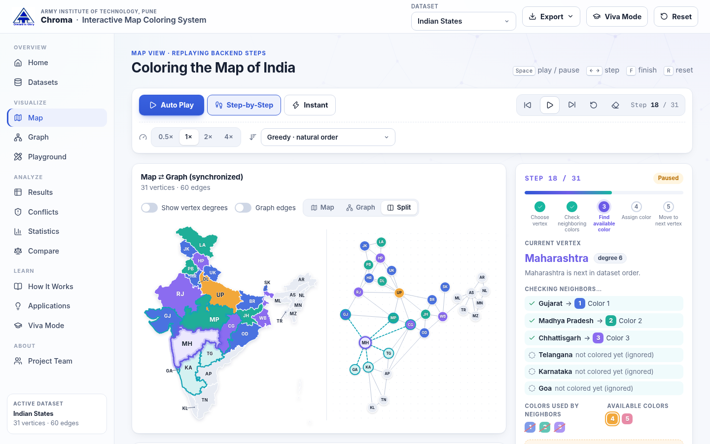
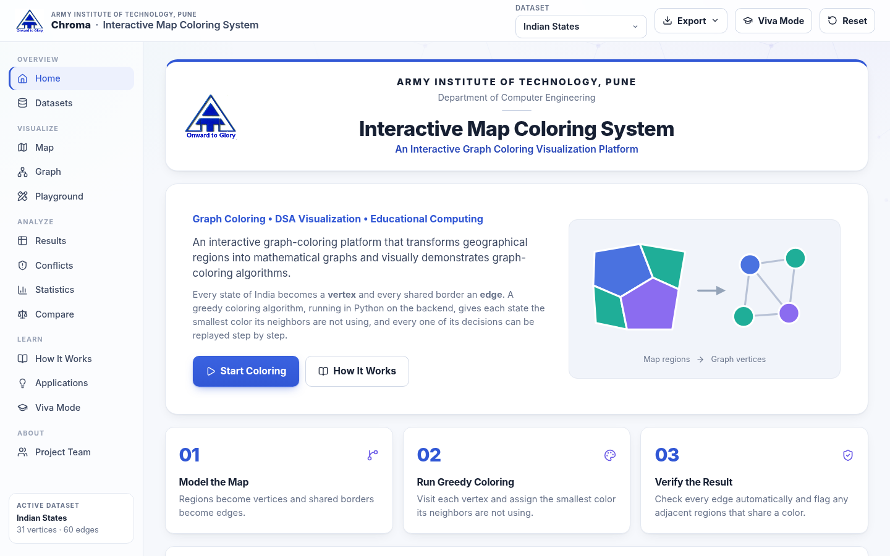
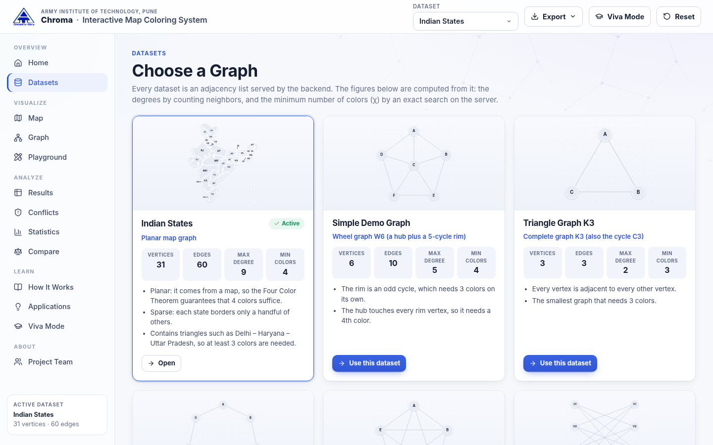
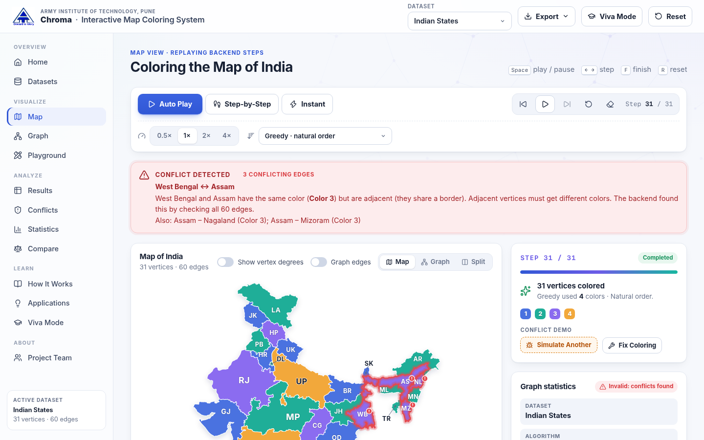
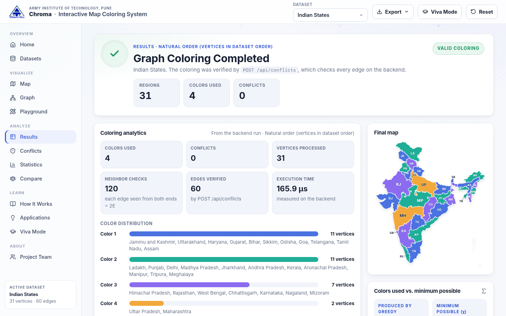
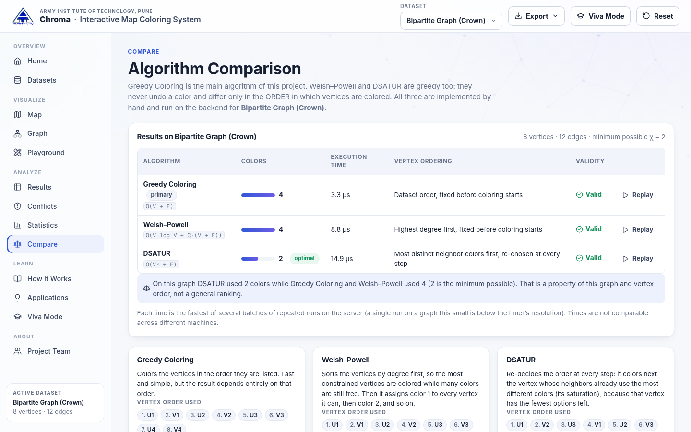
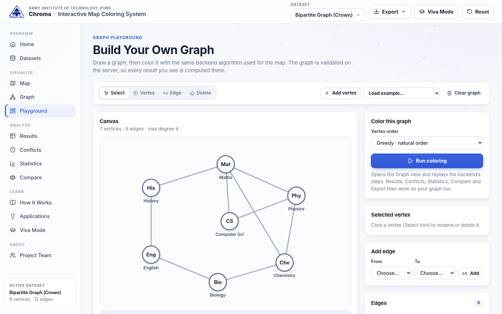
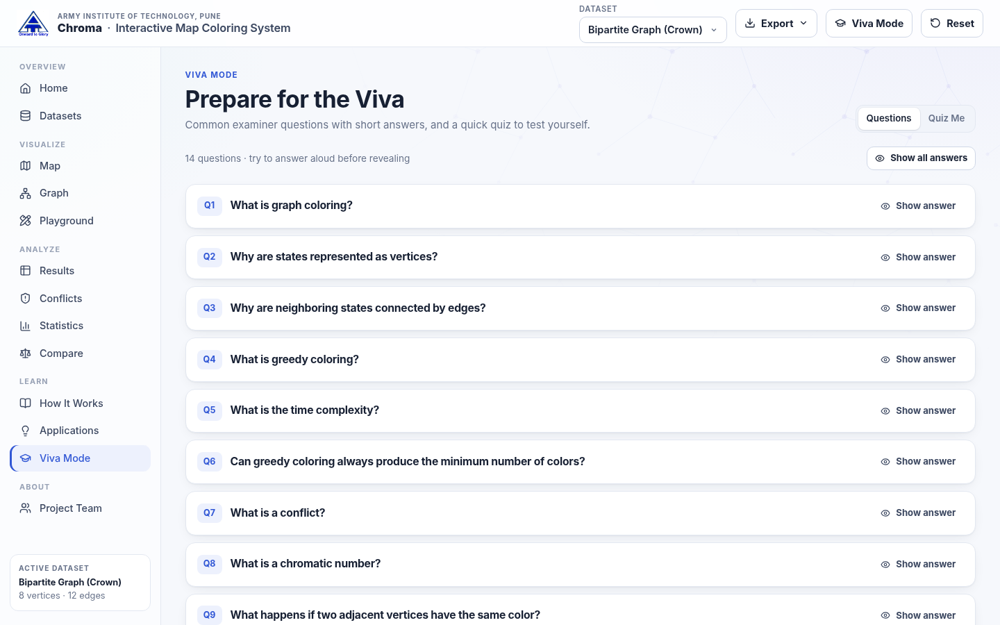
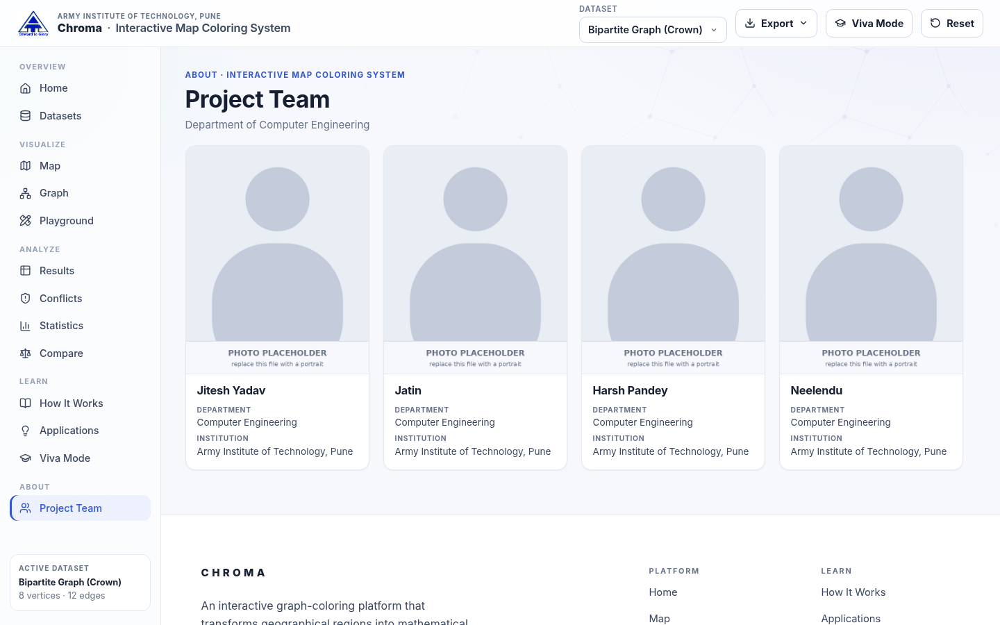

<p align="center">
  
</p>

<p align="center"><b>ARMY INSTITUTE OF TECHNOLOGY, PUNE</b><br>Department of Computer Engineering</p>

# Chroma

### Interactive Map Coloring System

**An Interactive Graph Coloring Visualization Platform**

*Graph Coloring • DSA Visualization • Educational Computing*

An interactive graph-coloring platform that transforms geographical regions into mathematical graphs and visually demonstrates graph-coloring algorithms.

*Chroma* is named after the **chromatic number** χ(G), the fewest colors a graph can be colored with.

Map coloring and graph coloring are classical problems in graph theory; this project is an educational implementation of them. The states of India become the **vertices** of a graph and their shared borders become **edges**. A hand-written **Greedy Graph Coloring** algorithm, running in Python on a FastAPI backend, colors the graph and records every decision it makes. The React frontend replays those recorded decisions on a real map of India and on a node-link graph, one phase at a time, so you watch the algorithm's actual reasoning rather than a scripted animation.

```
Region  → Vertex
Border  → Edge
Color   → Label assigned to a vertex (1, 2, 3, …)
```



---

## Contents

1. [Project Overview](#1-project-overview)
2. [Problem Statement](#2-problem-statement)
3. [Objectives](#3-objectives)
4. [Features](#4-features)
5. [Tech Stack](#5-tech-stack)
6. [System Architecture](#6-system-architecture)
7. [Graph Representation](#7-graph-representation)
8. [Greedy Coloring Algorithm](#8-greedy-coloring-algorithm)
9. [Algorithm Pseudocode](#9-algorithm-pseudocode)
10. [Time Complexity](#10-time-complexity)
11. [Space Complexity](#11-space-complexity)
12. [Dataset Structure](#12-dataset-structure)
13. [API Documentation](#13-api-documentation)
14. [Frontend Architecture](#14-frontend-architecture)
15. [Installation](#15-installation)
16. [Running Locally](#16-running-locally)
17. [Production Deployment](#17-production-deployment)
18. [Screenshots](#18-screenshots)
19. [Viva Questions](#19-viva-questions)
20. [Future Scope](#20-future-scope)
21. [References and Credits](#21-references-and-credits)
22. [Project Team](#22-project-team)

---

## 1. Project Overview

**Map coloring** asks for a color for each region of a map so that no two regions sharing a border get the same color. If each region is a *vertex* and each shared border is an *edge*, map coloring becomes **graph vertex coloring**, one of the classic problems of graph theory.

The underlying problems are well known; this project's contribution is the implementation and its integration:

* interactive geographical visualization, graph representation, and backend algorithm execution;
* step-by-step visualization, conflict detection, and map/graph synchronization;
* an educational Viva Mode, multiple graph datasets, and an offline-capable architecture.

Concretely, the system:

* stores **31 Indian regions** (28 states plus Jammu and Kashmir, Ladakh and Delhi; **60 shared land borders**) as an adjacency list on the backend, with a stable ID per region (`IN-MH`, `IN-GJ`, …);
* provides five textbook graphs (wheel, triangle K3, cycle C7, complete K5, bipartite crown graph) and a **Graph Playground** for building custom graphs;
* colors any of them with a hand-written **greedy coloring** algorithm (three vertex orders: natural, Welsh–Powell, DSATUR) that records every step;
* replays those steps on a **geographically accurate SVG map of India** (real state boundaries, stored locally) and on a draggable node-link graph, both kept in sync;
* verifies every result with a separate **conflict detector**, and can deliberately inject a conflict to demonstrate it;
* computes the **exact chromatic number** of each graph (when feasible) so that "colors used by greedy" and "minimum possible colors" are never confused;
* includes learning material: key terms, pseudocode, complexity analysis, real-world applications, a Viva Mode with a quiz, and exportable reports.

## 2. Problem Statement

Given an undirected graph G = (V, E), assign each vertex a color from {1, 2, 3, …} such that for every edge (u, v), color(u) ≠ color(v), using as few colors as possible.

The smallest number of colors for which this is possible is the **chromatic number χ(G)**. Deciding whether χ(G) ≤ k is NP-complete for every k ≥ 3, so no known algorithm finds the minimum quickly on every graph. In practice, fast heuristics such as **greedy coloring** are used: they always produce a valid coloring in linear time, but not necessarily one with the minimum number of colors.

Applied to a political map, the question becomes: *how can the states of India be colored so that neighboring states always look different?* This project answers it with a greedy algorithm, shows each of its decisions, and measures how close the result is to the true minimum.

## 3. Objectives

1. Model a real map as a graph (regions → vertices, borders → edges), using verified border data.
2. Implement greedy graph coloring from scratch, without any graph library, and record each decision.
3. Visualize the algorithm step by step on the map and on the graph, synchronized through stable vertex IDs.
4. Verify colorings independently (conflict detection) and demonstrate a detected conflict.
5. Analyze the algorithm: degrees, colors used, operation counts, execution time, complexity, and the exact chromatic number where computable.
6. Compare greedy coloring with Welsh–Powell and DSATUR on the same graphs, showing that vertex order matters.
7. Let users build and color their own graphs, and relate coloring to real applications (timetabling, register allocation, frequency assignment).
8. Deliver a responsive, accessible application that works offline after installation.

## 4. Features

| Area | What it does |
|---|---|
| **Institutional header** | Home opens with the AIT logo, *Army Institute of Technology, Pune*, *Department of Computer Engineering*, the project name and its supporting line |
| **Project Team** | A page (sidebar → About) with a card per team member: photo, name, department and institution |
| **Header** | AIT logo and institute name, project title, dataset selector, **Export Report**, **Viva Mode** and **Reset Experiment** buttons |
| **Footer** | On the Home and Project Team pages: the project's name and purpose, where it was built, links to the main sections, a large *CHROMA* wordmark, and © 2026 |
| **Datasets** | Gallery of all datasets with a live preview, graph type, characteristics, and computed V, E, Δ and χ |
| **Map view** | Real India state/UT boundaries (local SVG), hover tooltips, click/keyboard selection with neighbor highlighting and the selected region's edges, optional overlay of all graph edges, **Show vertex degrees**, and a **Map / Graph / Split** switch that keeps both views in sync |
| **Graph view** | Draggable node-link graph, degree badges, neighbor highlighting, vertex details card, adjacency list as a tree or a table |
| **Execution modes** | **Auto Play**, **Step-by-Step** and **Instant**. Each backend step is replayed in five phases: *choose vertex → check neighboring colors → find available color → assign color → move to next vertex* |
| **Playback bar** | Previous / Play-Pause / Next / Restart, speed **0.5× 1× 2× 4×**, "Step 7 / 31", vertex order (natural, Welsh–Powell, DSATUR); the step panel shows the current vertex, why it was chosen, neighbors and their colors, available colors and the selected color |
| **Graph statistics panel** | Dataset, algorithm, vertices, edges, max/min/average degree, colors used, minimum colors χ, conflicts, and validity, all computed from the actual graph and result |
| **Conflict detection** | `POST /api/conflicts` checks every edge. Conflicting vertices get a red outline, a ⚠ icon and a text explanation (never color alone); **Simulate Conflict** breaks the coloring on purpose, **Fix Coloring** restores the algorithm's result |
| **Results & analytics** | Colors used, color distribution ("Color 1 → 10 vertices"), conflicts, vertices processed, neighbor checks, edges verified, execution time, sortable assignment table, χ comparison |
| **Compare** | Greedy vs. Welsh–Powell vs. DSATUR on the same graph: colors, execution time, vertex ordering, validity, and a replay button for each |
| **Graph Playground** | Add / delete / rename vertices, add / delete edges (canvas or accessible forms), random graphs G(n, p), real-world examples, validation (no self-loops, duplicate edges or duplicate names), then color on the backend |
| **Learning** | How It Works (8 key terms, the algorithm in 6 steps, a live tutorial, pseudocode, complexity), Applications (7 real-world uses), Viva Mode (14 questions with answers + a 10-question quiz with scoring) |
| **Export** | Coloring result (JSON, CSV), graph adjacency list (TXT), algorithm execution report (TXT, with timestamp) |
| **Quality** | Friendly error states with Retry / Reset / Back to datasets, keyboard shortcuts and focus styles, ARIA labels, `prefers-reduced-motion`, responsive from 390 px phones to 1920 px projectors, fully offline |

## 5. Tech Stack

**Backend:** Python 3.10+ (3.12 on Vercel), FastAPI, Pydantic v2, Uvicorn (local server only). All graph algorithms are implemented by hand. No NetworkX or other graph library is used.

**Frontend:** React 18, Vite 8, plain JavaScript, native SVG, plain CSS, `framer-motion` (animation), `lucide-react` (icons). No CSS framework, no CDN, no web fonts, no map service: everything is bundled locally.

**Testing:** Python `unittest` (algorithms and HTTP API, standard library + uvicorn only) and a Playwright end-to-end script run against the real application.

## 6. System Architecture

```
┌────────────────────────────── Browser (React + Vite) ──────────────────────────────┐
│  views/*  ──uses──►  hooks/useColoring.js  ──calls──►  api/client.js  ── fetch /api │
│    │                 (state, playback clock,             (the only module that      │
│    │                  verification)                       talks to the backend)     │
│    └── visualization/IndiaMapSVG.jsx, GraphSVG.jsx, GraphEditor.jsx                 │
└──────────────────────────────────────────────────────────────────────┬──────────────┘
                    dev: Vite proxy /api → :8000   prod: VITE_API_URL   │
┌───────────────────────────────── FastAPI (Python) ───────────────────▼──────────────┐
│  main.py  ── routes ──►  algorithms/coloring.py   greedy (+ step trace), verify,    │
│                          algorithms/variants.py   Welsh–Powell, DSATUR, timing      │
│                          algorithms/chromatic.py  exact chromatic number (bounded)  │
│                   └──►  data/*.py               adjacency lists (single source)     │
└──────────────────────────────────────────────────────────────────────────────────────┘
```

Data flow:

```
Dataset (Python)  → GET /api/graph/{dataset}   → React draws the map / graph
User presses Play → POST /api/color            → greedy_coloring_with_steps() → coloring + steps
React replays the steps phase by phase         → map, graph, panels and timeline update together
Replay finishes   → POST /api/conflicts        → verdict (valid / conflicts)
```

Design decisions:

* **The backend is authoritative.** The frontend never computes a coloring. `coloringAtCursor()` rebuilds what is visible from the `assigned_color` values the backend returned, so the animation cannot show something the algorithm did not do.
* **Single source of truth for graphs.** Adjacency lists exist only in `backend/data/`. The frontend's `indiaGeometry.js` holds only drawing geometry (SVG paths, label anchors).
* **Stable identifiers.** Every vertex has an ID that never changes (`IN-MH` for Maharashtra, `v3` for a Playground vertex). Algorithms, API and UI use IDs; names are display-only. The map region and the graph vertex share the same ID, which is how selections and colors stay synchronized.

## 7. Graph Representation

Each graph is an **adjacency list**: a Python `dict` mapping a vertex ID to the list of adjacent vertex IDs.

```python
ADJACENCY = {
    "IN-GA": ["IN-MH", "IN-KA"],                                        # Goa
    "IN-MH": ["IN-GJ", "IN-MP", "IN-CG", "IN-TG", "IN-KA", "IN-GA"],    # Maharashtra
    ...
}
NAMES  = {"IN-GA": "Goa", "IN-MH": "Maharashtra", ...}   # display names
LABELS = {"IN-GA": "GA",  "IN-MH": "MH", ...}            # short labels on the map
```

The graph is undirected: if `B` is in `graph[A]`, then `A` is in `graph[B]`. `validate_graph()` enforces this and rejects self-loops, duplicate neighbors and unknown vertices; it runs at server start for every dataset and on every custom graph.

Why an adjacency list: map graphs are sparse (India: E = 60, while V(V−1)/2 = 465). The list needs O(V + E) memory instead of the O(V²) of an adjacency matrix, and it lists a vertex's neighbors in O(deg v), which is exactly the operation greedy coloring performs.

**Where the India edges come from.** `tools/build_india_map.py` (development-only) dissolves district boundaries from GIS data ([udit-001/india-maps-data](https://github.com/udit-001/india-maps-data)) into states, projects them (Lambert Conformal Conic), simplifies them together so neighbors keep an identical border, and **measures every shared land border**. Two regions are adjacent when they share at least ~10 km of border. That keeps the short Himachal Pradesh – Uttar Pradesh border and leaves out mere point contacts such as Uttarakhand – Haryana. The app never downloads map data at runtime.

## 8. Greedy Coloring Algorithm

Greedy coloring colors one vertex at a time and never changes a color once assigned:

1. **Select** the next vertex.
2. **Inspect** its adjacent vertices.
3. **Collect** the colors already used by its colored neighbors (uncolored neighbors are ignored).
4. **Choose** the smallest color 1, 2, 3, … that is not in that set.
5. **Assign** it.
6. **Repeat** until every vertex is colored.

Properties:

* **Always valid**: a vertex never takes a color that a colored neighbor has, and neighbors colored later avoid its color in turn.
* **At most Δ + 1 colors**, where Δ is the maximum degree: at most Δ colors can be blocked, so one of 1…Δ+1 is always free.
* **Not always optimal**: the result depends on the vertex order. On the bipartite crown graph (χ = 2), greedy in its natural order uses 4 colors.

The three supported vertex orders (`strategy`):

| Strategy | Order | Name in the app |
|---|---|---|
| `natural` | dataset order, fixed in advance | Greedy Coloring (the project's primary algorithm) |
| `largest_first` | highest degree first, fixed in advance | Welsh–Powell |
| `dsatur` | re-chosen at every step: the uncolored vertex whose neighbors use the most distinct colors (ties → higher degree → dataset order) | DSATUR |

`welsh_powell_coloring()` also implements Welsh–Powell in its classic color-by-color form; a test verifies that it produces exactly the same coloring as greedy in largest-first order.

**Worked example** (the tutorial graph `mini`, edges A–B, A–C, B–D, C–D, C–E, D–E):

| Step | Vertex | Colored neighbors | Blocked | Assigned |
|---|---|---|---|---|
| 1 | A | none | none | **1** |
| 2 | B | A=1 | 1 | **2** |
| 3 | C | A=1 | 1 | **2** |
| 4 | D | B=2, C=2 | 2 | **1** |
| 5 | E | C=2, D=1 | 1, 2 | **3** |

Three colors; C, D, E form a triangle, so 3 is the minimum and greedy is optimal here. `test_mini_tutorial_graph_walkthrough` checks these exact values.

## 9. Algorithm Pseudocode

```
GREEDY-COLORING(G, order)
    color ← empty map                    // vertex → color number
    for each vertex v in order:          // 1. select a vertex
        used ← empty set
        for each neighbor u of v:        // 2. inspect adjacent vertices
            if u has a color:
                add color[u] to used     // 3. colors already taken
        c ← 1
        while c ∈ used:                  // 4. smallest available color
            c ← c + 1
        color[v] ← c                     // 5. assign it
    return color                         // 6. every vertex is colored

IS-VALID(G, color)
    for each edge (u, v) in G:
        if color[u] = color[v]: return false     // a conflict
    return true
```

`backend/algorithms/coloring.py` follows this line for line (`greedy_coloring`). `greedy_coloring_with_steps` runs the same loop and additionally records, for each vertex, why it was selected, its neighbors and their colors, the blocked and available colors, and the assigned color.

## 10. Time Complexity

Let **V** = vertices, **E** = edges, **Δ** = maximum degree, **C** = colors in use.

| Part | Cost | Why |
|---|---|---|
| Visit every vertex | O(V) | the outer loop runs once per vertex |
| Collect neighbor colors | O(E) | each adjacency entry (2E in total) is read once |
| Find the smallest free color | O(V + E) | at most deg(v) + 1 hash-set lookups per vertex |
| **Greedy coloring, natural order** | **O(V + E)** | |
| Welsh–Powell order | O(V log V + E) | plus one sort by degree |
| DSATUR order | O(V² + E) | an O(V) scan for the most saturated vertex before each step |
| Step trace for the animation | + O(V·C) | listing every available color 1…C+1 at each step |
| Conflict detection | O(V + E) | each edge checked once |
| Exact chromatic number | exponential in the worst case | backtracking; bounded by a node and time budget |

So the core algorithm is **O(V + E)**, as expected. The traced version the app actually runs is O(V + E + V·C) for the natural order; since C ≤ Δ + 1 this is at most O(V·Δ). The API reports the complexity of the strategy used (`statistics.time_complexity`).

Measured on India (natural order): **120 neighbor checks (= 2E)** and **62 candidate-color tests** for 31 vertices. The Statistics page shows these counts for every run.

## 11. Space Complexity

| Structure | Space |
|---|---|
| Adjacency list (input) | O(V + E): V keys and 2E entries |
| Coloring | **O(V)** |
| `used` set for one vertex | O(Δ) |
| **Greedy coloring, extra space** | **O(V)** |
| Step trace (for the replay) | O(V + E): each step stores the vertex's neighbor list |
| DSATUR saturation sets | O(V + E) |

## 12. Dataset Structure

Each dataset is a Python module under `backend/data/` and is registered in `data/__init__.py`:

```python
{
    "key": "india",                     # URL key
    "name": "Indian States",
    "kind": "map" | "graph",            # "map" has SVG geometry in the frontend
    "graph_type": "Planar map graph",
    "description": "...",
    "characteristics": ["Planar: ...", "Sparse: ...", ...],
    "adjacency": { vertex_id: [vertex_id, ...] },
    "layout": { vertex_id: {"x": ..., "y": ...} },   # node positions for the graph view
    "labels": { vertex_id: "MH" },                   # short labels
    "names":  { vertex_id: "Maharashtra" },          # display names
    "chromatic": { "value": 4, "exact": true, ... }  # computed once at startup
}
```

All figures below are computed by the backend from the adjacency lists (none are typed in by hand):

| Dataset | Type | V | E | Δ | δ | χ (exact) | Greedy (natural) | Welsh–Powell | DSATUR |
|---|---|---|---|---|---|---|---|---|---|
| Indian States | planar map graph | 31 | 60 | 9 (Uttar Pradesh) | 1 | 4 | 4 | 4 | 4 |
| Simple Demo Graph | wheel W6 | 6 | 10 | 5 | 3 | 4 | 4 | 4 | 4 |
| Triangle Graph K3 | complete K3 | 3 | 3 | 2 | 2 | 3 | 3 | 3 | 3 |
| Cycle Graph C7 | odd cycle | 7 | 7 | 2 | 2 | 3 | 3 | 3 | 3 |
| Complete Graph K5 | complete K5 | 5 | 10 | 4 | 4 | 5 | 5 | 5 | 5 |
| Bipartite Graph (Crown) | K4,4 minus a perfect matching | 8 | 12 | 3 | 3 | 2 | **4** | **4** | **2** |
| Mini tutorial graph (hidden) | small planar | 5 | 6 | 3 | 2 | 3 | 3 | 3 | 3 |

The **chromatic number** is computed by `algorithms/chromatic.py`: a lower bound from a greedily found clique, an upper bound from the three heuristics, and an exact backtracking search (DSATUR branching, symmetry breaking) in between, limited to 200 000 search nodes and 0.4 s. If the budget runs out (possible for large dense custom graphs), the API reports `value: null` with the proven bounds instead of guessing.

The small union territories (Chandigarh, Puducherry, Dadra & Nagar Haveli and Daman & Diu, Lakshadweep, Andaman & Nicobar Islands) are drawn on the map for completeness but are not vertices: they are enclaves or islands and add nothing to the problem.

## 13. API Documentation

Base URL (local): `http://127.0.0.1:8000`. Interactive OpenAPI docs: `/docs`.

Errors are JSON: **404** for an unknown dataset (with the list of valid keys), **422** for invalid input (Pydantic validation or an invalid graph, with an explanation), **500** with a short message (never a stack trace).

A *graph source* is either `{"dataset": "<key>"}` or a custom graph `{"graph": {id: [ids]}, "names": {id: name}}`. Vertex IDs match `[A-Za-z0-9_.:-]{1,32}`; custom graphs are limited to 60 vertices and 600 edges.

### `GET /api/health`
```json
{ "status": "ok", "service": "coloring-engine", "datasets": 6 }
```

### `GET /api/datasets`
```json
[{ "key": "complete", "name": "Complete Graph K5", "kind": "graph", "graph_type": "Complete graph K5",
   "description": "...", "characteristics": ["..."], "vertices": 5, "edges": 10,
   "max_degree": 4, "min_degree": 4, "average_degree": 4.0,
   "chromatic_number": 5, "chromatic_exact": true }, "..."]
```

### `GET /api/graph/{dataset}`
`dataset` ∈ `india`, `sample`, `triangle`, `cycle`, `complete`, `bipartite` (and `mini`).
```json
{
  "key": "india", "name": "Indian States", "kind": "map", "graph_type": "Planar map graph",
  "vertices": ["IN-JK", "IN-LA", "..."],
  "edges": [["IN-JK", "IN-LA"], "..."],
  "adjacency": { "IN-PB": ["IN-JK", "IN-HP", "IN-HR", "IN-RJ"], "...": [] },
  "layout": { "IN-PB": { "x": 170, "y": 155 } },
  "labels": { "IN-PB": "PB" }, "names": { "IN-PB": "Punjab" },
  "statistics": { "vertices": 31, "edges": 60, "max_degree": 9, "min_degree": 1,
                  "average_degree": 3.87, "density": 0.129, "greedy_upper_bound": 10, "degrees": {} },
  "chromatic": { "value": 4, "exact": true, "lower_bound": 4, "upper_bound": 4,
                 "method": "Exact backtracking search: fewer than 4 colors is impossible", "search_nodes": 6 }
}
```

### `POST /api/analyze`
Validates a custom graph (from the Playground) and returns it in the same format as `GET /api/graph` with `key: "custom"`.
```json
{ "graph": { "v1": ["v2"], "v2": ["v1"] }, "names": { "v1": "Maths", "v2": "Physics" },
  "layout": { "v1": { "x": 100, "y": 80 } } }
```

### `POST /api/color`
```json
{ "dataset": "india", "strategy": "natural" }
```
`strategy` ∈ `natural` (default), `largest_first`, `dsatur`. A custom graph can be sent instead of `dataset`. Response (abridged):
```json
{
  "dataset": "india", "algorithm": "Greedy Graph Coloring",
  "strategy": "natural", "strategy_label": "Natural order (vertices in dataset order)",
  "coloring": { "IN-JK": 1, "IN-LA": 2, "...": 0 }, "colors_used": 4,
  "order": ["IN-JK", "IN-LA", "..."],
  "steps": [{
    "step": 18, "vertex": "IN-MH", "degree": 6, "saturation": 3,
    "selection": "Maharashtra is next in dataset order.",
    "neighbors": ["IN-GJ", "IN-MP", "IN-CG", "IN-TG", "IN-KA", "IN-GA"],
    "neighbor_colors": { "IN-GJ": 1, "IN-MP": 2, "IN-CG": 3 },
    "uncolored_neighbors": ["IN-TG", "IN-KA", "IN-GA"],
    "used_colors": [1, 2, 3], "rejected_colors": [1, 2, 3], "available_colors": [4, 5],
    "assigned_color": 4, "is_new_color": false, "colors_in_use": 4,
    "message": "Neighbors block Color 1, 2, 3. Smallest available color is 4."
  }],
  "valid": true, "conflicts": [],
  "statistics": { "colors_used": 4, "conflicts": 0, "time_complexity": "O(V + E + V·C)",
                  "core_time_complexity": "O(V + E)", "space_complexity": "O(V + E)",
                  "neighbor_checks": 120, "color_checks": 62, "execution_ms": 0.1, "...": "graph statistics" }
}
```

### `POST /api/conflicts`
```json
{ "dataset": "india", "coloring": { "IN-PB": 1, "IN-HR": 1 } }
```
```json
{ "valid": false,
  "conflicts": [{ "region_a": "IN-PB", "region_b": "IN-HR", "color": 1 }],
  "conflicting_vertices": ["IN-HR", "IN-PB"], "uncolored": ["IN-JK", "..."], "checked_edges": 60 }
```
A coloring that names unknown vertices returns 422.

### `POST /api/compare`
```json
{ "dataset": "bipartite" }
```
```json
{ "dataset": "bipartite", "vertices": 8, "edges": 12,
  "results": [
    { "key": "greedy", "name": "Greedy Coloring", "strategy": "natural", "colors_used": 4,
      "execution_ms": 0.0028, "ordering": "Dataset order, fixed before coloring starts",
      "time_complexity": "O(V + E)", "order": ["U1", "V1", "..."], "coloring": {}, "valid": true, "conflicts": 0 },
    { "key": "welsh_powell", "colors_used": 4, "...": "..." },
    { "key": "dsatur", "colors_used": 2, "...": "..." } ],
  "chromatic": { "value": 2, "exact": true, "...": "..." } }
```
Execution times are the fastest of several batches of repeated runs (timeit-style), because a single run on these graphs takes only microseconds.

## 14. Frontend Architecture

```
frontend/src/
├── App.jsx                  layout, hash navigation, page transitions, error/loading states, footer
├── api/client.js            the only module that calls fetch: base URL, timeouts,
│                            friendly error messages, response-shape checks, GET cache
├── hooks/
│   ├── useColoring.js       all coloring state: graph, result, 5-phase playback clock,
│   │                        verification, conflict demo, custom graphs
│   ├── usePlayground.js     editable graph for the Playground (validated operations)
│   ├── useShortcuts.js      Space / ← → / F / R
│   └── useMediaQuery.js
├── visualization/
│   ├── IndiaMapSVG.jsx      map: fills, outlines, labels, degrees, edges, conflict icons
│   ├── GraphSVG.jsx         draggable node-link graph
│   └── GraphEditor.jsx      Playground canvas (mouse, touch and keyboard)
├── components/              ColoringControls (playback bar), StepPanel, GraphInfoPanel,
│                            AlgorithmTimeline, Pseudocode, Legend, VertexCard, VizStage,
│                            ConflictBanner, ConflictDemoButtons, ColorDistribution,
│                            ChromaticCard, ExportMenu, ExportPanel, InstitutionalHeader,
│                            InstituteLogo, TeamCard, SiteFooter (Home and Team pages), …
├── views/                   Home, Datasets, Map, Graph, Playground, Results, Conflicts,
│                            Statistics, Compare, HowItWorks, Applications, Viva, Team
├── content/                 identity (name, tagline, institution, credits), team, learning
│                            material, viva questions and quiz, applications, Playground examples
├── assets/branding/         ait-logo.png, the official institute logo (see the README there)
├── data/indiaGeometry.js    generated state boundaries (SVG paths, label anchors)
├── utils/                   constants (palette, phases, speeds), replay (cursor → coloring and
│                            highlight), status summaries, helpers, export builders
└── styles/                  variables.css (tokens), globals.css, features.css, animations.css

frontend/public/team/        team photos (jitesh.jpg, jatin.jpg, harsh.jpg, neelendu.jpg);
                             replace a file to update a portrait, no code change needed
```

* **One state hook.** `useColoring` owns the graph, the backend result and the playback cursor `{step, phase}`. A single `setTimeout` drives Auto Play; pausing, resetting or unmounting clears it. Previous/Next move the cursor, and the visible coloring is derived from it, so stepping back is exact.
* **One highlight object** (`active`, `neighbors`, `recent`, `next`) is shared by the map, the graph and the panels, so every view agrees on what is happening.
* **Algorithms stay on the server.** The frontend contains no coloring logic; it only draws what the backend returned. Datasets and learning content live in their own modules, separate from the UI components.
* **Accessibility.** Map regions and graph nodes are keyboard-focusable buttons with descriptive labels ("Maharashtra, degree 6, color 4, in conflict with a neighbor"); conflicts use color + icon + text; all controls have labels; animations respect `prefers-reduced-motion`.

## 15. Installation

Requirements: **Python 3.10+** and **Node.js `^20.19.0 || >=22.12.0`** (required by Vite 8). After installation no internet connection is needed.

```bash
# Backend
cd backend
python3 -m venv venv
source venv/bin/activate            # Windows: venv\Scripts\activate
pip install -r requirements.txt

# Frontend (second terminal)
cd frontend
npm install
```

No `--force` or `--legacy-peer-deps` flags are needed; `package-lock.json` is committed.

## 16. Running Locally

```bash
# Terminal 1: the coloring engine on http://127.0.0.1:8000
cd backend && source venv/bin/activate
uvicorn main:app --reload

# Terminal 2: the web app on http://localhost:5173
cd frontend
npm run dev
```

The Vite dev server forwards every `/api` request to port 8000, so no URL or CORS setup is needed. Options: `API_TARGET=http://host:port npm run dev` points the proxy elsewhere; `npm run build && npm run preview` serves a production build on port 4173 through the same proxy.

Keyboard shortcuts on the Map and Graph pages: **Space** play/pause, **← →** previous/next phase, **F** finish instantly, **R** reset.

### Running the tests

```bash
cd backend
python -m unittest discover -s tests -v
```

42 tests, standard library + uvicorn only:

* `test_coloring.py` (16): greedy on empty, single-vertex, triangle and complete graphs K1–K7; every dataset with all three strategies (valid, ≤ Δ + 1 colors); traced steps equal the plain algorithm; the tutorial walkthrough; stable IDs, names and labels; known India borders; conflict detection.
* `test_algorithms.py` (12): Welsh–Powell equals largest-first greedy (datasets + 40 random graphs); DSATUR validity, bipartite optimality, and that every DSATUR step picks a most-saturated vertex; the crown-graph counterexample; chromatic numbers of known graphs (cycles, Petersen graph, all datasets) and agreement with brute force on 80 random graphs; honest "unknown" when the search budget runs out.
* `test_api.py` (14): starts the real app with uvicorn and calls every endpoint over HTTP, including 404/422 error cases, custom graphs, invalid graphs (self-loop, one-way edge, unknown vertex, duplicate edge, empty graph, bad ID, too large) and the CORS preflight.

## 17. Production Deployment

The frontend and backend are deployed as **two separate Vercel projects**. Deploy both together: the frontend expects the API version in this repository.

### Backend (FastAPI on Vercel)

* **Root Directory:** `backend` (Project Settings → Build and Deployment).
* **Framework:** FastAPI. `backend/vercel.json` sets `"framework": "fastapi"`, so a project that Vercel auto-detected as *Services* builds correctly. Vercel imports `main:app`; uvicorn is not used there.
* **Python:** 3.12 (`backend/.python-version`), dependencies from `requirements.txt`.
* **Environment variable (optional):** `FRONTEND_URL` = the frontend's origin, e.g. `https://your-frontend.vercel.app` (comma-separate several). When set, only those origins may call the API from a browser; when unset, any origin may, which is safe because the API is public, read-only and uses no credentials.

### Frontend (Vite static site)

* **Root Directory:** `frontend` · **Install:** `npm install` · **Build:** `npm run build` · **Output:** `dist`.
* **`VITE_API_URL`** = the backend origin **without** `/api`. It is committed in `frontend/.env.production` (`https://backend-tau-eight-78.vercel.app`); a value set in the hosting platform overrides it. Vite embeds it **at build time**, so redeploy the frontend after changing it. The production build never calls `localhost`.
* The build splits the bundle into app code, libraries and the map geometry, so browsers cache the parts that rarely change.

## 18. Screenshots

| | |
|---|---|
|  **Home**: institutional header and entry points |  **Datasets**: computed V, E, Δ and χ for every graph |
|  **Step-by-step replay**: step 18, Maharashtra; neighbors block colors 1–3, so it takes color 4 (map and graph in sync) |  **Conflict detection**: a simulated conflict found by the backend, shown with outline, ⚠ icon and text |
|  **Results**: analytics, color distribution, χ comparison, export |  **Compare**: on the crown graph DSATUR needs 2 colors, greedy and Welsh–Powell 4 |
|  **Graph Playground**: the exam-timetable example |  **Viva Mode**: questions with answers and a quiz |
|  **Project Team**: the four team members | |

## 19. Viva Questions

The app's **Viva Mode** contains these questions with answers (some answers include live figures from the loaded dataset) and a scored quiz.

1. **What is graph coloring?** Assigning a color to every vertex so that the endpoints of every edge have different colors, usually with as few colors as possible.
2. **Why are states represented as vertices?** Coloring only cares about which regions must differ, not their shape; each state needs exactly one color, so it is one vertex.
3. **Why are neighboring states connected by edges?** An edge encodes the constraint "these two must differ". States touching only at a point are not neighbors.
4. **What is greedy coloring?** Visit vertices one by one and give each the smallest color not used by its colored neighbors; never revise a decision.
5. **What is the time complexity?** O(V + E): each vertex once, each adjacency entry once, and the smallest free color within deg(v) + 1 tries. Extra space O(V). (This app's traced version adds O(V·C) time and O(V + E) space for the replay.)
6. **Can greedy always produce the minimum number of colors?** No. The crown graph needs 2 colors, but greedy in the order U1, V1, U2, V2, … uses 4. Greedy guarantees at most Δ + 1.
7. **What is a conflict?** An edge whose endpoints share a color. A coloring is valid exactly when there are none; checking takes O(V + E).
8. **What is a chromatic number?** χ(G), the minimum number of colors for a valid coloring. Computing it is NP-hard; greedy only gives an upper bound. For India, χ = 4.
9. **What happens if two adjacent vertices have the same color?** The coloring is invalid; on a map the border between the two states would disappear. "Simulate Conflict" demonstrates it.
10. **Why is the backend responsible for coloring?** One source of truth: data, algorithm and verification live together, are unit-tested, and every client sees the same result; the UI only replays the recorded steps.
11. **What is the difference between a graph and a map?** A map is geometry; a graph is pure structure (who touches whom). Map graphs are planar, so four colors always suffice.
12. **What are real-world applications?** Exam and course timetabling, register allocation, frequency and Wi-Fi channel assignment, job scheduling, map coloring.
13. **How do Welsh–Powell and DSATUR differ from greedy?** Same rule, different order: Welsh–Powell sorts by degree once; DSATUR picks the most saturated vertex at each step.
14. **Why does India need only four colors?** Its graph is planar, and the Four Color Theorem guarantees 4 colors for every planar graph. The backend proves that 3 are not enough.

Further questions worth preparing: What is an adjacency list, and why use it instead of a matrix? (O(V + E) vs O(V²) space for a sparse graph.) What is an independent set? (Each color class is one.) What does greedy do on a complete graph Kn? (n colors, which is optimal.) Is there always a vertex order for which greedy is optimal? (Yes: order the vertices class by class following an optimal coloring.)

## 20. Future Scope

* **Exact coloring for larger graphs**: integer programming or SAT-based solvers to find χ where backtracking is too slow.
* **More heuristics**: Recursive Largest First (RLF), tabu search or simulated annealing, compared on the same page.
* **More maps**: districts of a state, or other countries, generated with the same `tools/build_india_map.py` pipeline.
* **Edge and list coloring**, and weighted variants such as timetabling with room capacities.
* **Persistent Playground graphs** (save/load as JSON) and sharing through URLs.
* **Performance mode** for graphs with thousands of vertices (canvas/WebGL rendering, a heap-based DSATUR in O((V + E) log V)).

Current limitations:

* Boundaries are simplified to about 3 km precision (≈ 75 KB of geometry). They follow the source dataset, which draws India's official extent (Jammu and Kashmir includes PoK; Ladakh includes Gilgit-Baltistan and Aksai Chin).
* Only the India dataset has map shapes; other graphs are shown as node-link diagrams.
* Custom graphs live in the browser session only and are limited to 60 vertices (30 in the Playground editor).
* The exact chromatic number is only guaranteed within the search budget; beyond it the app shows proven bounds.
* Dragged node positions reset when the page reloads or the dataset changes.

## 21. References and Credits

This project implements and visualizes well-known results; it does not claim them as its own.

* **Graph coloring and the Four Color Theorem.** K. Appel and W. Haken, "Every planar map is four colorable", *Illinois Journal of Mathematics*, 21 (1977).
* **Welsh–Powell.** D. J. A. Welsh and M. B. Powell, "An upper bound for the chromatic number of a graph and its application to timetabling problems", *The Computer Journal*, 10(1), 1967.
* **DSATUR.** D. Brélaz, "New methods to color the vertices of a graph", *Communications of the ACM*, 22(4), 1979.
* **NP-completeness of graph coloring.** R. M. Karp, "Reducibility among combinatorial problems", 1972; M. R. Garey and D. S. Johnson, *Computers and Intractability*, 1979.
* **Map data.** State boundaries are derived from the district-level GeoJSON of [udit-001/india-maps-data](https://github.com/udit-001/india-maps-data), processed offline by `tools/build_india_map.py`. The app never loads map data at runtime.
* **Libraries.** React, Vite, Framer Motion and Lucide icons (frontend); FastAPI, Pydantic and Uvicorn (backend).

Developed as an academic project in the Department of Computer Engineering, Army Institute of Technology, Pune.

## 22. Project Team

Department of Computer Engineering, Army Institute of Technology, Pune.

| Member | Department | Institution |
|---|---|---|
| Jitesh Yadav | Computer Engineering | Army Institute of Technology, Pune |
| Jatin | Computer Engineering | Army Institute of Technology, Pune |
| Harsh Pandey | Computer Engineering | Army Institute of Technology, Pune |
| Neelendu | Computer Engineering | Army Institute of Technology, Pune |

The portraits shown in the app are placeholders until real photos are added to `frontend/public/team/` (same file names; see the README in that folder). The member list lives in `frontend/src/content/team.js`.

© 2026 Chroma · Interactive Map Coloring System

